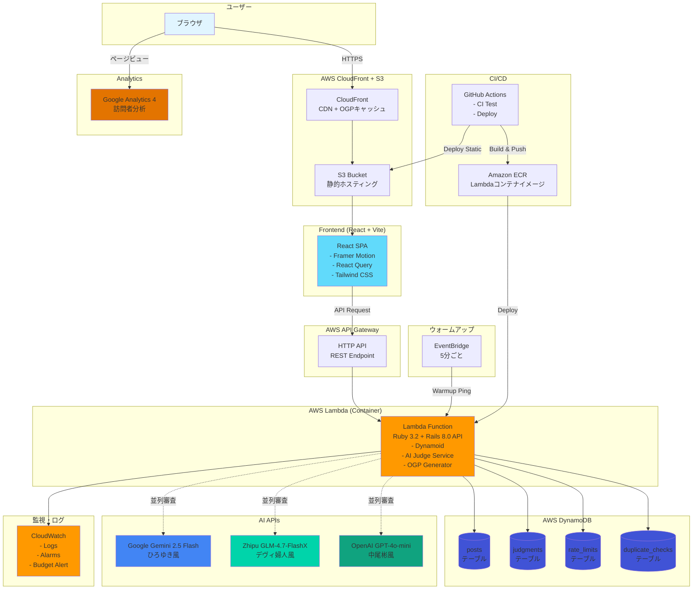

# 🏟️ aruaruarena（あるあるアリーナ）

**3人のAI審査員が採点する、超短文「あるある」ランキング・ミニアプリ**

[](https://github.com/yourusername/aruaruarena/actions)
[](LICENSE)

---

## 📖 概要

「あるあるアリーナ（aruaruarena）」は、誰もが共感できる「あるある」を**3〜30文字**で投稿し、3人のAI審査員（ひろゆき風、デヴィ婦人風、中尾彬風）が自動採点するエンターテインメント型ミニアプリです。

※本プロジェクトは特定の人物・番組・企業とは無関係のパロディ表現を含みます。

### ✨ 特徴

- 🤖 **AI審査員3人による自動採点**
  - ひろゆき風（Gemini 2.5 Flash）: 論理的、否定的、独創性重視
  - デヴィ婦人風（GLM-4.7-FlashX）: 上品、感情的、言語センス重視
  - 中尾彬風（GPT-4o-mini）: 豪快、共感的、総合的な笑い重視

- 📊 **リアルタイムランキング**
  - TOP 50ランキング
  - 自分の投稿位置を即座に確認可能

- 🖼️ **動的OGP画像生成**
  - 審査完了時にOGP画像を自動生成
  - SNSシェア時に投稿内容・スコアを表示

- 🎨 **キャラクターアニメーション**
  - 審査中にキャラクターが動く（Framer Motion）
  - ランダムで口癖を発言

- 🔒 **完全匿名投稿**
  - ログイン不要
  - ニックネームのみで参加可能
  - 自分の投稿はブラウザ（LocalStorage）で管理

---

## 🎯 投稿ルール

### 投稿内容
- **文字数**: 3〜30文字（厳守）
- **絵文字も1文字として厳密にカウント**（Unicodeのgrapheme単位）
- **内容**: 誰もが共感できる「あるある」
- **例**:
  - 「スヌーズ押して二度寝」（11文字）
  - 「充電20%で不安発動」（11文字）
  - 「Wi-Fi遅い時だけルーター触る」（17文字）

### ニックネーム
- **文字数**: 1〜20文字
- **推奨**: 8文字以内（超過分は一覧で省略表示）
- **重複**: OK（投稿IDで区別）

### 投稿制限（スパム対策）
- 同一IP: **5分に1回**
- 同一ニックネーム: **5分に1回**
- 同一テキスト: 24時間以内に同じ内容は投稿不可

---

## 🏆 採点基準

各審査員が5項目×20点満点で採点（合計100点満点）

| 項目 | 配点 | 説明 |
|-----|------|------|
| **共感度** | 20点 | どれだけ多くの人が共感できるか |
| **面白さ** | 20点 | 笑える、クスッとくる |
| **簡潔さ** | 20点 | 短くシンプルに表現できているか |
| **独創性** | 20点 | 他にない視点、新しい発見 |
| **表現力** | 20点 | 言葉の選び方、語感 |

### 審査員の採点バイアス

| 審査員 | 重視項目 | 性格 |
|-------|---------|------|
| **ひろゆき風** | 独創性(+3)、共感度(-2) | 「それって本当？」と疑う |
| **デヴィ婦人風** | 表現力(+3)、面白さ(+2) | 「品がある」を重視 |
| **中尾彬風** | 面白さ(+3)、共感度(+2) | 「わかるわかる！」と共感 |

### 平均点の計算
- 3人成功: 3人の平均点（小数第1位）
- 2人成功: 2人の平均点
- 1人以下: 審査失敗、再審査ボタン表示
- 再審査: **失敗した審査員のみ再実行**（コスト最小化）

### ランキング同点ルール
- 同点の場合: **早い投稿が上位**

---

## 🖼️ OGP画像生成

### 概要
SNSでシェアされた際に、投稿内容とスコアを含む動的なOGP画像を表示します。

### 戦略: ウォームアップ方式
審査完了時にOGP画像を事前生成し、CloudFrontにキャッシュします。

```
審査完了 → RubyスレッドでOGP URLにリクエスト → CloudFrontがキャッシュ → SNSクローラーは高速取得
```

### フロー
1. **審査完了**: `status` が `scored` に変更
2. **ウォームアップ**: `Thread.new` で自身のOGP URLにHTTPリクエスト（最大0.5秒待機）
3. **画像生成**: `mini_magick` でベース画像にテキスト合成
4. **キャッシュ**: CloudFrontが1週間キャッシュ
5. **SNSシェア**: キャッシュ済み画像を即座に配信

### 実装例
```ruby
# app/models/post.rb
def warm_ogp_cache
  thread = Thread.new do
    uri = URI("https://api.example.com/ogp/posts/#{id}.png")
    Net::HTTP.get(uri)
  rescue => e
    Rails.logger.warn("OGP warmup failed: #{e.message}")
  end
  thread.join(0.5)  # 最大0.5秒だけ待つ（Lambda環境対策）
end
```

### メリット
- ✅ 追加コストなし（S3保存不要）
- ✅ インフラ追加なし（SQS/Job不要）
- ✅ SNSクローラーのタイムアウト回避

---

## 🛠️ 技術スタック

### Backend
- **Ruby 3.2.2** + **Rails 8.0 (API mode)**
- **DynamoDB** (NoSQL、オンデマンドモード)
- **AWS Lambda** (Dockerコンテナデプロイ)
- **API Gateway** (HTTP API)
- **mini_magick** (動的OGP画像生成)
- **RSpec** (テスト)

### Frontend
- **React 18** + **TypeScript**
- **Vite** (ビルドツール)
- **Framer Motion** (アニメーション)
- **TanStack Query** (データ取得・キャッシュ)
- **Tailwind CSS** (スタイリング)
- **Playwright** (E2Eテスト)

### AI APIs
- **Gemini 2.5 Flash** (Google) - ひろゆき風
- **GLM-4.7-FlashX** (Zhipu AI) - デヴィ婦人風
- **GPT-4o-mini** (OpenAI) - 中尾彬風

### Infrastructure
- **Terraform** (IaC)
- **AWS CloudFront** (CDN + OGPキャッシュ)
- **AWS S3** (静的ホスティング)
- **AWS EventBridge** (ウォームアップ)
- **GitHub Actions** (CI/CD)

### Analytics
- **Google Analytics 4** (訪問者分析)

---

## 🏗️ インフラ構成図



---

## 📁 プロジェクト構成

```
aruaruarena/
├── .github/
│   ├── workflows/
│   │   ├── test.yml            # CI: RSpec, RuboCop, Brakeman
│   │   └── deploy.yml          # CD: Deploy to AWS Lambda
│   └── ISSUE_TEMPLATE/
│       ├── spec.md             # 仕様策定 (SDD/TDD)
│       └── bug_report.md       # バグ報告
│
├── backend/                  # Rails 8 API Mode
│   ├── app/
│   │   ├── controllers/
│   │   │   └── api/v1/       # API Versioning
│   │   │       ├── posts_controller.rb
│   │   │       ├── rankings_controller.rb
│   │   │       └── ogp_controller.rb
│   │   ├── models/
│   │   │   ├── post.rb
│   │   │   └── judgment.rb
│   │   ├── services/         # Business Logic
│   │   │   ├── ai_judge_service.rb
│   │   │   ├── spam_detector.rb
│   │   │   ├── rate_limiter.rb
│   │   │   └── ogp_generator.rb
│   │   ├── adapters/         # AI API Adapters (Strategy Pattern)
│   │   │   ├── base_ai_adapter.rb
│   │   │   ├── gemini_adapter.rb
│   │   │   ├── glm_adapter.rb
│   │   │   └── openai_adapter.rb
│   │   └── prompts/          # AI Prompt Templates
│   │       ├── hiroyuki.txt
│   │       ├── dewi.txt
│   │       └── nakao.txt
│   │   └── lambda.rb         # Lambda Handler
│   ├── config/
│   │   ├── initializers/
│   │   │   ├── dynamoid.rb   # DynamoDB Config
│   │   │   └── cors.rb
│   │   └── routes.rb
│   ├── spec/                 # Testing (TDD/RSpec)
│   │   ├── factories/        # FactoryBot
│   │   │   ├── posts.rb
│   │   │   └── judgments.rb
│   │   ├── models/
│   │   ├── requests/         # API Integration Tests
│   │   │   └── api/v1/
│   │   ├── services/
│   │   ├── adapters/
│   │   └── support/          # Test Config
│   │       ├── dynamoid.rb   # DynamoDB Local for Test
│   │       ├── vcr.rb        # API Mocking
│   │       └── factory_bot.rb
│   ├── Gemfile
│   ├── Dockerfile
│   └── compose.yml           # Backend Services
│
├── frontend/                 # React SPA (Vite)
│   ├── src/
│   │   ├── components/
│   │   ├── hooks/
│   │   ├── utils/
│   │   └── App.tsx
│   ├── package.json
│   └── vite.config.ts
│
├── terraform/                # Infrastructure as Code
│   ├── main.tf
│   ├── dynamodb.tf
│   ├── lambda.tf
│   ├── s3.tf
│   ├── cloudfront.tf
│   └── api_gateway.tf
│
├── docs/                     # Documentation
│   ├── db_schema.md          # DB Schema (DynamoDB)
│   ├── screen_design.md      # UI/UX Design
│   └── Gemfile.md            # Dependency Policy
│
├── .gitignore
├── CLAUDE.md                 # AI Agent Rules
├── .coderabbit.yaml          # AI Review Config
└── README.md
```

---

## 🚀 セットアップ

### 前提条件
- Node.js 18+
- Ruby 3.2.2
- Docker & Docker Compose
- AWS CLI
- Terraform 1.6+
- ImageMagick（OGP画像生成用）

### API Keys（必須）
- Gemini API Key (Google AI Studio)
- GLM-4.7-FlashX API Key (Zhipu AI)
- OpenAI API Key

### 1. リポジトリのクローン

```bash
git clone https://github.com/yourusername/aruaruarena.git
cd aruaruarena
```

### 2. 環境変数の設定

```bash
cp .env.example .env
# .envを編集してAPI Keyを設定
```

**.env.example**
```env
# Common
APP_ENV=development
AWS_REGION=ap-northeast-1

# DynamoDB
DYNAMODB_TABLE_POSTS=aruaruarena-posts
DYNAMODB_TABLE_JUDGEMENTS=aruaruarena-judgments
DYNAMODB_TABLE_RATE_LIMITS=aruaruarena-rate-limits
DYNAMODB_TABLE_DUPLICATE_CHECKS=aruaruarena-duplicate-checks
DYNAMODB_ENDPOINT=http://localhost:8000

# AI APIs
GEMINI_API_KEY=your-gemini-key
GLM_API_KEY=your-glm-key
OPENAI_API_KEY=your-openai-key

# Frontend
REACT_APP_API_URL=http://localhost:3000/api
REACT_APP_GA_MEASUREMENT_ID=G-XXXXXXXXXX
```

### 3. バックエンドのセットアップ

```bash
cd backend
bundle install

# DynamoDB Localを起動
docker-compose up -d

# テーブル作成
bundle exec rails dynamoid:create_tables

# サーバー起動
bundle exec rails s
```

### 4. フロントエンドのセットアップ

```bash
cd frontend
npm install
npm run dev
# → http://localhost:5173
```

### 5. テストの実行

```bash
# バックエンド
cd backend
bundle exec rspec

# フロントエンド
cd frontend
npm test
npm run test:e2e  # Playwright E2E
```

---

## 🌐 デプロイ

### 1. AWSインフラの構築

```bash
cd terraform
terraform init
terraform plan
terraform apply
```

### 2. GitHub Secrets設定

リポジトリの Settings > Secrets で以下を設定：

- `AWS_ACCESS_KEY_ID`
- `AWS_SECRET_ACCESS_KEY`
- `GEMINI_API_KEY`
- `GLM_API_KEY`
- `OPENAI_API_KEY`

### 3. 自動デプロイ

`main` ブランチへのマージで自動デプロイ（GitHub Actions）

---

## 📡 API仕様

### POST /api/posts
あるあるを投稿

**リクエスト**
```json
{
  "nickname": "太郎",
  "body": "スヌーズ押して二度寝"
}
```

**レスポンス**
```json
{
  "id": "550e8400-e29b-41d4-a716-446655440000",
  "status": "judging"
}
```

### GET /api/posts/:id
投稿詳細と審査状況

**レスポンス**
```json
{
  "id": "550e8400-...",
  "nickname": "太郎",
  "body": "スヌーズ押して二度寝",
  "average_score": 85.3,
  "rank": 12,
  "total_count": 500,
  "judgments": [
    {
      "persona": "hiroyuki",
      "total_score": 82,
      "empathy": 14,
      "humor": 17,
      "brevity": 18,
      "originality": 19,
      "expression": 14,
      "comment": "それって本当にあるあるですか？",
      "success": true
    },
    {
      "persona": "dewi",
      "total_score": 90,
      "comment": "まぁ、共感できるわ！",
      "success": true
    },
    {
      "persona": "nakao",
      "total_score": 84,
      "comment": "わかるわかる！",
      "success": true
    }
  ]
}
```

### GET /api/rankings
ランキング取得（TOP50）

**レスポンス**
```json
{
  "rankings": [
    {
      "rank": 1,
      "id": "aaa-111",
      "nickname": "太郎",
      "body": "スヌーズ押して二度寝",
      "average_score": 95.3
    }
  ],
  "total_count": 500
}
```

### GET /api/my-rank/:id
自分の順位確認

**レスポンス**
```json
{
  "rank": 123,
  "total_count": 500,
  "post": { /* ... */ }
}
```

### POST /api/posts/:id/rejudge
失敗した審査員の再審査

**リクエスト**
```json
{
  "failed_personas": ["dewi"]
}
```

### GET /ogp/posts/:id.png
動的OGP画像取得

---

## 🗄️ データベース設計

詳細は [docs/db_schema.md](docs/db_schema.md) を参照。

### posts テーブル

| 属性 | 型 | 説明 |
|-----|---|------|
| id | String | UUID (Primary Key) |
| nickname | String | 1-20文字 |
| body | String | 3-30文字（grapheme） |
| average_score | Number | 平均点 (小数第1位: Decimal/Float) |
| judges_count | Number | 成功した審査員数 (0-3の整数, App default: 0) |
| status | String | judging / scored / failed (App default: judging, GSI PK兼用) |
| score_key | String | GSI SK (スコア降順 + 作成日時昇順) |
| created_at | Number | UnixTimestamp (seconds/整数) |

**GSI: RankingIndex**
- Partition Key: `status`
- Sort Key: `score_key`
- 用途: TOP20ランキング取得 (`ScanIndexForward=false` / スパースインデックス)

### judgments テーブル

| 属性 | 型 | 説明 |
|-----|---|------|
| post_id | String | Partition Key |
| persona | String | Sort Key: hiroyuki / dewi / nakao (上書き型) |
| id | String | UUID (ログ・デバッグ用) |
| succeeded | Boolean | API成功/失敗 (App default: false) |
| error_code | String | 失敗時のエラーコード |
| empathy, humor, brevity, originality, expression | Number | 各0-20の整数 (失敗時はNULL) |
| total_score | Number | 0-100の整数 (失敗時はNULL) |
| comment | String | 審査コメント (失敗時はNULL) |
| judged_at | Number | 最終審査日時 (UnixTimestamp/整数) |

> **Note:** 再審査時は同じ persona で上書き保存。過去履歴は CloudWatch Logs で管理。

### rate_limits テーブル

| 属性 | 型 | 説明 |
|-----|---|------|
| identifier | String | Primary Key (`ip#hash` または `nick#hash`) |
| expires_at | Number | TTL（5分後に自動削除） |

### duplicate_checks テーブル

| 属性 | 型 | 説明 |
|-----|---|------|
| body_hash | String | Primary Key（正規化後ハッシュ） |
| expires_at | Number | TTL（24時間後に自動削除） |
| post_id | String | 最初に登録された投稿ID（トレース用） |

---

## 💰 コスト見積もり

### 前提（3ヶ月運用）
- 月間投稿: 500件
- 月間PV: 5,000
- AI呼び出し: 1,500回/月

### AWS（AI除く）

| サービス | 月額 |
|---------|------|
| Lambda | $0（Always Free範囲内） |
| DynamoDB | $0.21 |
| S3 | $0 |
| CloudFront | $0 |
| API Gateway | $0 |
| CloudWatch | $0.05 |
| **合計** | **$0.26/月** |

### AI API

| API | 単価 | 月額（500投稿） |
|-----|------|----------------|
| Gemini 2.5 Flash | ~$0.001 | $0.50 |
| GLM-4.7-FlashX | ~$0.002 | $1.00 |
| GPT-4o-mini | ~$0.0015 | $0.75 |
| **合計** | - | **$2.25/月** |

### 3ヶ月総コスト
- AWS: $0.78
- AI: $6.75
- **合計: $7.53**

---

## 🔐 セキュリティ

### 実装済み
- ✅ レート制限（IP/ニックネーム5分制限）
- ✅ スパム検出（同一テキスト24時間制限）
- ✅ 入力バリデーション
- ✅ HTTPS強制（CloudFront）
- ✅ CORS設定
- ✅ API Key環境変数管理
- ✅ Brakeman（脆弱性スキャン）

### 今後の検討
- 🔜 reCAPTCHA
- 🔜 不適切コンテンツフィルター

---

## 📊 監視・アラート

### CloudWatch
- 予算超過アラート（$10）
- Lambda エラー（5回以上）
- DynamoDB スロットリング

### ログ
- CloudWatch Logs: 7日間保存

---

## 📄 利用規約 & プライバシーポリシー

### 概要
本サービスは、ユーザーが「あるある」を投稿し、AIが採点するエンターテインメントサービスです。

### データの取り扱い
- **投稿データ**: ニックネーム、テキスト、スコアは公開され、永久保存されます。
- **LocalStorage**: 自分の投稿の強調表示のために使用。個人を特定する情報は収集しません。
- **Google Analytics**: 匿名のアクセス解析を行います。

### 禁止事項
- 法令違反
- 誹謗中傷
- 過度な性的・暴力的内容
- スパム・連投

### 免責事項
- AI採点はエンターテインメント目的であり、正確性・公平性を保証しません。
- 本サービス利用により生じた損害について、運営者は責任を負いません。

### お問い合わせ
aruaruarena.official@gmail.com

---

## 🐛 トラブルシューティング

### DynamoDB Localに接続できない
```bash
docker ps  # コンテナ起動確認
curl http://localhost:8000
```

### AI APIがタイムアウト
- API Keyの有効性確認
- レート制限確認

### Cold Startが遅い
```bash
# EventBridge動作確認
aws events list-rules --name-prefix aruaruarena
```

---

## 🤝 コントリビューション

1. Fork
2. Feature ブランチ作成
3. Commit
4. Push
5. Pull Request

---

## 📝 ライセンス

MIT License

---

## 👥 作者

- GitHub: [@yourusername](https://github.com/yourusername)
- Contact: aruaruarena.official@gmail.com

---

**🏟️ あるあるアリーナで、あなたの「あるある」を世界に届けよう！**

---

## 🎨 UI/UX Design


### Sound Design (BGM & SE)
「レトロフューチャー＆プレイフル」をテーマに、誰もが知るクラシック曲を使用。

#### BGM (Classical Masterpieces)
| シーン | 曲名 (原曲) | イメージ・演出意図 | ループ |
|:---:|:---|:---|:---:|
| **トップ / 投稿 / 閲覧** | 🎵 <br> **ラデツキー行進曲** <br> (ヨハン・シュトラウス1世) | **手拍子・祝祭感** <br> 「これから楽しいことが始まる！」というポジティブな導入。 <br> ※ランキング閲覧中も継続再生 | 〇 |
| **審査中 (Wait)** | 🤡 <br> **道化師のギャロップ** <br> (カバレフスキー) | **ドタバタ・パニック（運動会）** <br> AIが大慌てで審査して駆け回るコミカルなスピード感。 | 〇 |
| **結果発表 (TOP50入)** | 🏆 <br> **威風堂々 第1番** <br> (エルガー) | **大勝利・表彰式** <br> 堂々たる勝利のファンファーレ。「やったぞー！」 | × |
| **結果発表 (圏外/失敗)** | ⚡ <br> **運命 (冒頭)** <br> (ベートーヴェン) | **衝撃・ガーン！** <br> わかりやすい失敗音。「ジャジャジャジャーン！」 | × |

#### SE (Sound Effects)
- **Click**: カチッ（硬質なシステム音）
- **Count Up**: ピピピピ...（得点上昇）
- **Stamp**: ドン！（重低音で決定時の高揚感）
- **Share**: ピロリン♪（SNSシェア時のポジティブ音）
- **Mute Toggle**: 必須（デフォルトOFF/ON切り替え）

#### Technical Requirements
- **Library**: **Howler.js** (Web Audio API wrapper)
- **Format**: `.mp3` (汎用性重視)
- **Transition**: シーン切り替え時は **クロスフェード (0.5s)** 推奨
- **Persist**: ミュート状態を `localStorage` に保存・復元
